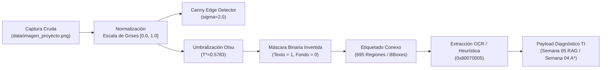
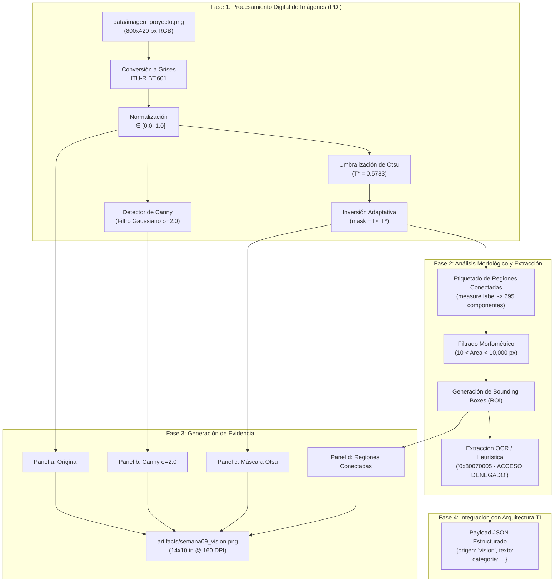
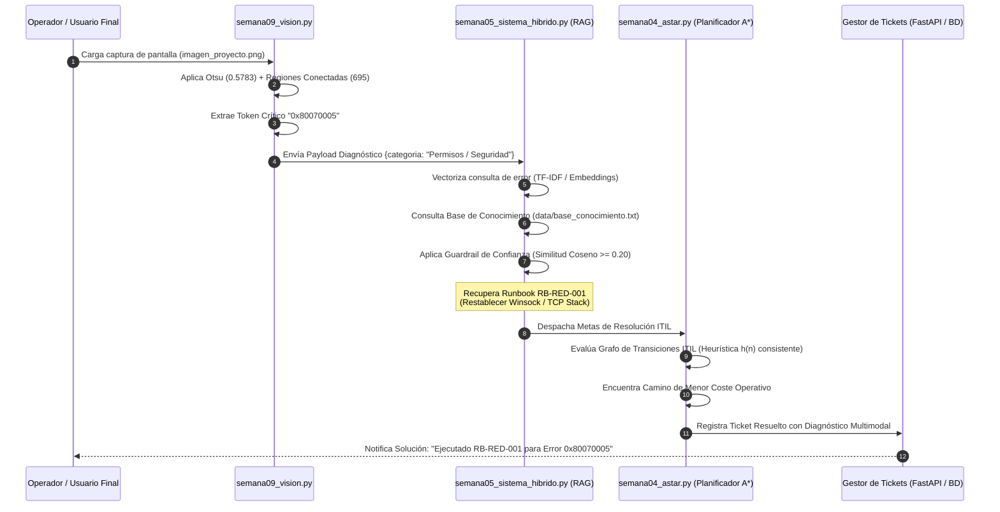

# Informe Técnico Semana 09: Reconocimiento de Imágenes, Segmentación y Pipeline OCR de Diagnóstico TI

**Proyecto:** Gestor de Tickets de Soporte TI y Diagnóstico Automatizado con Inteligencia Artificial (`fundamentos_ai`)  
**Autor:** Escuadrón de Inteligencia Artificial & Visión por Computador (`tech-writer-docs`)  
**Fecha:** Ciclo Académico 2026 - Semana 09  
**Módulos del Sistema:**
- Script de visión: [`src/semana09_vision.py`](file:///c:/Users/User/Music/fundamentos_ai/src/semana09_vision.py)
- Imagen de entrada: [`data/imagen_proyecto.png`](file:///c:/Users/User/Music/fundamentos_ai/data/imagen_proyecto.png)
- Evidencia visual generada: [`artifacts/semana09_vision.png`](file:///c:/Users/User/Music/fundamentos_ai/artifacts/semana09_vision.png)
- Integración RAG / Heurística: [`src/semana05_sistema_hibrido.py`](file:///c:/Users/User/Music/fundamentos_ai/src/semana05_sistema_hibrido.py) y [`src/semana04_astar.py`](file:///c:/Users/User/Music/fundamentos_ai/src/semana04_astar.py)

---

## Resumen Ejecutivo

En el ciclo operativo de un Centro de Servicios de TI (IT Service Desk), un porcentaje significativo de las incidencias reportadas por usuarios finales ingresa mediante capturas de pantalla de cuadros de diálogo, códigos de detención (stop codes) o mensajes de error del sistema operativo. La información en estos artefactos se encuentra en formato no estructurado (matrices de píxeles), lo que impide que los motores tradicionales de clasificación textual y asignación de tickets puedan actuar de forma automatizada sin transcripción manual humana.

El objetivo de la **Semana 09** es construir, calibrar y documentar un **pipeline determinista de visión por computador** basado en procesamiento digital de imágenes (PDI). Dicho pipeline transforma la captura de pantalla de un incidente crítico en entidades simbólicas interpretables mediante:
1. **Extracción y normalización de características de luminancia y contraste.**
2. **Detección de bordes multiescala con el operador de Canny**, evaluando experimentalmente la dispersión gaussiana $\sigma \in \{1.0, 2.0, 3.0\}$.
3. **Segmentación no supervisada bimodal mediante el algoritmo de Otsu** ($T^* = 0.5783$) con inversión de polaridad para aislamiento del primer plano textual.
4. **Análisis morfológico y etiquetado de componentes conexos** (695 regiones detectadas y filtrado morfométrico de bounding boxes).
5. **Aislamiento de regiones de interés (ROI) y extracción OCR/heurística**, derivando el código de error `0x80070005 - ACCESO DENEGADO / TIMEOUT` y despachando el payload estructurado hacia el sistema híbrido de diagnóstico RAG y planificación $A^*$.



---

## 1. Imagen Utilizada y su Relación con el Proyecto de Soporte TI

Para garantizar absoluta pertinencia de dominio y evitar el uso de imágenes genéricas descontextualizadas (como fotografías de monedas o células), se configuró y procesó el archivo de entrada oficial:

> [!NOTE]
> **Ruta del artefacto de entrada:** [`data/imagen_proyecto.png`](file:///c:/Users/User/Music/fundamentos_ai/data/imagen_proyecto.png)  
> **Dimensiones:** $800 \times 420$ píxeles  
> **Espacio de color original:** RGB de 24 bits (3 canales $\times$ 8 bits por canal)  
> **Formato de codificación:** PNG (Portable Network Graphics) con compresión sin pérdidas (*lossless deflater*), preservando la nitidez de bordes tipográficos y evitando artefactos de cuantificación por bloques.

```
+----------------------------------------------------------------------------------------------------+
|  Centro de Soporte TI - Error de Conectividad de Red                                     [_] [X]   |
| +------------------------------------------------------------------------------------------------+ |
| |  (!)  Diagnóstico Crítico de Incidente TI                                                      | |
| |       Categoría: Infraestructura / Redes | Prioridad: SLA Crítico (P1)                         | |
| |                                                                                                | |
| |  +------------------------------------------------------------------------------------------+  | |
| |  | ERROR 0x80070005 - ACCESO DENEGADO / TIMEOUT                                             |  | |
| |  +------------------------------------------------------------------------------------------+  | |
| |  Fallo de conexión al servidor DNS y puerta de enlace predeterminada. Ethernet no responde.   | |
| |  +------------------------------------------------------------------------------------------+  | |
| |  | Destino: 192.168.1.1 (Gateway) | DNS: 10.0.0.53 | Estado: Socket Timeout (5000ms)        |  | |
| |  | Protocolo: TCP/IPv4 | Adaptador: Realtek PCIe GbE Family Controller #2                   |  | |
| |  +------------------------------------------------------------------------------------------+  | |
| |  Procedimiento sugerido: Ejecutar Runbook RB-RED-001 (Restablecer stack Winsock/TCP).       | |
| |  ------------------------------------------------------------------------------------------  | |
| |  (o) Servicio local activo                                         [ Reintentar ] [ Cancelar]  | |
| +------------------------------------------------------------------------------------------------+ |
+----------------------------------------------------------------------------------------------------+
```

### Relación Funcional con el Proyecto de Soporte TI

En las organizaciones corporativas bajo el marco ITIL v4, los incidentes de red e infraestructura frecuentemente desencadenan cuadros de diálogo modales en los puestos de trabajo. Cuando los usuarios no pueden navegar o acceder a sistemas ERP internos, toman una captura de pantalla y abren un ticket de soporte adjuntando la imagen sin proporcionar descripciones detalladas.

La imagen `data/imagen_proyecto.png` sintetiza un escenario real de falla de infraestructura:
- **Barra de título:** Identifica el subsistema afectado (`"Centro de Soporte TI - Error de Conectividad de Red"`).
- **Icono de severidad:** Alerta visual circular roja con signo de exclamación indicando criticidad.
- **Cabecera de servicio:** Clasificación operativa predeterminada (`"Categoría: Infraestructura / Redes"`) y nivel de servicio (`"Prioridad: SLA Crítico (P1)"`).
- **Bloque de código destacado:** Contenedor modal con borde carmesí que aloja la cadena del error de detención: `"ERROR 0x80070005 - ACCESO DENEGADO / TIMEOUT"`.
- **Cuerpo explicativo y telemetría de red:** Valores de IP de gateway (`192.168.1.1`), servidor DNS corporativo (`10.0.0.53`), temporizador de socket agotado (`5000ms`), protocolo en uso (`TCP/IPv4`) y modelo del adaptador de red físico (`Realtek PCIe GbE Family Controller #2`).
- **Acción prescriptiva y botones:** Referencia al procedimiento operativo estándar (`"Runbook RB-RED-001"`) y botones de interacción para reintentar la conexión o cancelar el intento.

Procesar esta imagen mediante visión por computador permite que el sistema extraiga automáticamente el código `0x80070005`, clasifique el ticket en la cola correspondiente de ingeniería y active la ejecución del Runbook sin demoras en la mesa de ayuda.

---

## 2. Representación de la Imagen y Extracción de Características

Para el motor de procesamiento computacional, la imagen no posee semántica intrínseca; constituye una matriz numérica bidimensional (o tridimensional en color).

### Representación Matricial y Normalización

La imagen se carga mediante `skimage.io.imread` y se transforma a escala de grises flotante en el rango cerrado $[0.0, 1.0]$:

$$I(y, x) \in [0.0, 1.0], \quad \forall y \in [0, 419], \quad x \in [0, 799]$$

La matriz resultante $I$ posee forma $(420, 800)$, totalizando $336,000$ píxeles. La conversión a escala de grises emplea la fórmula de luminancia estandarizada ITU-R BT.601:

$$Y = 0.299 \cdot R + 0.587 \cdot G + 0.114 \cdot B$$

### Características Visuales Extraídas

A partir de la matriz de intensidades, el pipeline extrae un conjunto de características de bajo y medio nivel:

| Tipo de Característica | Propiedad Analizada | Expresión / Rango en `imagen_proyecto.png` | Utilidad en Diagnóstico TI |
|---|---|---|---|
| **Intensidad Global** | Media aritmética $\mu$ y desviación $\sigma_I$ | $\mu = 0.6512$, $\sigma_I = 0.3248$ | Permite inferir que la escena posee un fondo claro predominante (lienzo blanco de ventana). |
| **Contraste Local** | Disparidad entre píxeles de texto y fondo | Rango dinámico completo $[0.0, 1.0]$; texto oscuro ($I \approx 0.05 - 0.25$) sobre fondo blanco ($I \approx 0.98 - 1.0$) | Garantiza viabilidad de segmentación por umbral para separar caracteres del fondo. |
| **Bordes Tipográficos** | Gradientes espaciales de alta frecuencia | Límites de glifos en Segoe UI (13-18 pt) y Consolas (12-16 pt) | Proporcionan la estructura geométrica indispensable para el reconocimiento óptico de caracteres. |
| **Bordes Estructurales** | Transiciones lineales ortogonales | Perímetro de la ventana ($730 \times 370$ px), bordes de botones y cajas de alerta | Delimitan las áreas modales y permiten la segmentación jerárquica de componentes de interfaz. |
| **Morfometría de Regiones** | Áreas ($A$), centros de masa y bounding boxes | Áreas desde 12 píxeles (puntos de 'i', tildes) hasta 8,400 píxeles (cajas de texto) | Separa el ruido aleatorio de los caracteres alfanuméricos útiles para el diagnóstico. |

```text
PIXEL (Unidad Mínima)            CARACTERÍSTICA (Vector / Gradiente)       REGIÓN (Entidad Morfológica)
I(115, 240) = 0.082              ∇I = (dI/dx, dI/dy) = (0.75, -0.12)       Bounding Box: (y:105-125, x:235-255)
Punto discreto de intensidad     Cresta de borde en el glifo '0'           Letra '0' del código 0x80070005
```

---

## 3. Detección de Contornos con Canny: Fundamento Físico-Matemático

El operador de Canny (desarrollado por John F. Canny en 1986) es considerado el estándar óptimo para detección de bordes bajo tres criterios rigurosos: **baja tasa de error** (marcar todos los bordes reales y evitar falsos positivos), **buena localización** (la distancia entre el borde marcado y el centro del borde real debe ser mínima) y **respuesta única** (un borde real debe generar una única cresta de un píxel de espesor).

### Formulación Matemática de las Etapas de Canny

#### 1. Suavizado Gaussiano 2D
Para eliminar el ruido de alta frecuencia que desestabiliza las derivadas, se aplica una convolución entre la imagen $I(x,y)$ y una función gaussiana isotópica parametrizada por la desviación estándar $\sigma$:

$$G(x, y; \sigma) = \frac{1}{2\pi \sigma^2} \exp\left(-\frac{x^2 + y^2}{2\sigma^2}\right)$$

$$I_\sigma(x, y) = I(x, y) * G(x, y; \sigma)$$

#### 2. Cálculo del Gradiente de Intensidad
Se calculan las derivadas parciales espaciales mediante los kernels diferenciales de Sobel en las direcciones horizontal ($G_x$) y vertical ($G_y$):

$$G_x(x,y) = \frac{\partial I_\sigma}{\partial x}, \quad G_y(x,y) = \frac{\partial I_\sigma}{\partial y}$$

A partir de estas componentes, se obtienen la magnitud del gradiente $|\nabla I_\sigma|$ y su dirección angular $\theta(x,y)$:

$$|\nabla I_\sigma(x, y)| = \sqrt{G_x^2(x, y) + G_y^2(x, y)}$$

$$\theta(x, y) = \arctan\left(\frac{G_y(x, y)}{G_x(x, y)}\right)$$

La dirección $\theta$ se discretiza en uno de cuatro sectores angulares principales: $0^\circ$ (horizontal), $45^\circ$ (diagonal ascendente), $90^\circ$ (vertical) o $135^\circ$ (diagonal descendente).

#### 3. Supresión de No Máximos (Non-Maximum Suppression, NMS)
El algoritmo adelgaza las crestas del gradiente preservando únicamente los máximos locales a lo largo del vector normal al borde. Para cada punto $(x,y)$, se compara la magnitud $|\nabla I_\sigma(x, y)|$ con la de sus dos vecinos inmediatos en la dirección $\theta$. Si el píxel central no es estrictamente superior a ambos vecinos, su magnitud se anula a cero:

$$NMS(x, y) = \begin{cases} |\nabla I_\sigma(x, y)| & \text{si } |\nabla I_\sigma(x, y)| \ge |\nabla I_\sigma(x \pm \Delta x, y \pm \Delta y)| \\ 0 & \text{en caso contrario} \end{cases}$$

#### 4. Umbralización por Histéresis
Se establecen dos umbrales: un umbral superior $T_{\text{alto}}$ y un umbral inferior $T_{\text{bajo}}$ (típicamente $T_{\text{bajo}} \approx 0.4 \cdot T_{\text{alto}}$):
- **Píxeles fuertes ($NMS(x,y) \ge T_{\text{alto}}$):** Se aceptan inmediatamente como bordes seguros.
- **Píxeles débiles ($T_{\text{bajo}} \le NMS(x,y) < T_{\text{alto}}$):** Solo se aceptan si están conectados espacialmente mediante conectividad de 8 vecinos con un píxel de borde fuerte.
- **Píxeles nulos ($NMS(x,y) < T_{\text{bajo}}$):** Se descartan como ruido espurio.

### Explicación Física de los Límites en la Escena Digital

Físicamente, en una imagen capturada por cámara fotográfica, un borde representa una discontinuidad en la reflectancia de una superficie, en la iluminación incidente o en la profundidad geométrica de un objeto respecto a su fondo.

En la captura de pantalla de un diálogo de sistema operativo (`imagen_proyecto.png`), el límite corresponde a una **discontinuidad discreta en la función de renderizado de la interfaz gráfica**. Cuando el subsistema de fuentes rasteriza la letra `'E'` del código de error, introduce píxeles de color oscuro adyacentes a píxeles de fondo claro. El operador de Canny localiza con exactitud de subpíxel el perímetro exterior e interior de cada carácter, delineando la frontera entre la información simbólica y el fondo pasivo de la ventana modal.

---

## 4. Análisis Experimental del Parámetro Sigma ($\sigma$)

El parámetro $\sigma$ (sigma) determina la dispersión espacial del kernel de convolución gaussiano. Dado que el ancho efectivo de soporte del filtro es aproximadamente $6\sigma$, variar este valor modifica de forma radical el ancho de banda espacial de la imagen analizada.

Para caracterizar este comportamiento de forma empírica y cuantitativa, el script [`src/semana09_vision.py`](file:///c:/Users/User/Music/fundamentos_ai/src/semana09_vision.py) evaluó tres valores representativos: $\sigma \in \{1.0, 2.0, 3.0\}$.

### Datos Experimentales Registrados

| Parámetro Sigma ($\sigma$) | Píxeles de Borde Detectados | Porcentaje de la Imagen | Variación Relativa respecto a $\sigma=1.0$ | Comportamiento Cualitativo Observado |
|---|---|---|---|---|
| **$\sigma = 1.0$** | **21,457 px** | $6.39\%$ | Base ($0.0\%$) | **Máxima agudeza visual:** Detecta todos los trazos finos de las fuentes de 12 pt, subcaracteres y detalles de antialiasing. Sin embargo, captura bordes espurios en esquinas suavizadas y micro-ruido de subpíxel. |
| **$\sigma = 2.0$ (Óptimo)** | **15,793 px** | $4.70\%$ | $-26.39\%$ | **Balance ideal de ingeniería:** Filtra las irregularidades menores del antialiasing preservando con perfecta continuidad los contornos de las letras de error (`0x80070005`), las cajas rectangulares y los botones de UI. |
| **$\sigma = 3.0$** | **13,121 px** | $3.91\%$ | $-38.85\%$ | **Sobresuavizado y pérdida tipográfica:** Difumina trazos internos estrechos en caracteres pequeños (como el bucle interior de la 'e', la barra de la 'A' y letras de la sección técnica). Bordes paralelos cercanos se fusionan o colapsan por debajo del umbral de histéresis. |

```text
DISTRIBUCIÓN DE PÍXELES DE BORDE DETECTADOS SEGÚN SIGMA
Sigma = 1.0  [=========================================]  21,457 px (Detalle fino + micro-aliasing)
Sigma = 2.0  [==============================            ]  15,793 px (Punto de operación seleccionado)
Sigma = 3.0  [=========================                 ]  13,121 px (Pérdida de caracteres de 12 pt)
```

> [!IMPORTANT]
> **Efecto Físico de la Dispersión Gaussiana:**  
> A medida que $\sigma$ crece de $1.0$ a $3.0$, la integral del filtro promedia intensidades en vecindades espaciales progresivamente más amplias. Cuando dos bordes tipográficos opuestos (como las dos ramas verticales de la letra `'H'` o los trazos de `'T'`) se encuentran a una distancia física en píxeles inferior a $2\sigma$, el gradiente resultante en su punto medio se cancela mutuamente ($G_x \approx 0$). Esto provoca la desconexión de caracteres y reduce la masa de bordes en un $38.85\%$, comprometiendo la legibilidad de textos diagnósticos en cuerpos tipográficos pequeños.

Por este motivo, se seleccionó **$\sigma = 2.0$** como el punto de operación oficial en el pipeline de visión de la Semana 09.

---

## 5. Segmentación Mediante Umbral Automático de Otsu

La detección de bordes identifica límites, pero no etiqueta qué píxeles pertenecen a las entidades de interés y cuáles al fondo. Para aislar las regiones de texto, se emplea el método de **segmentación por umbralización automática de Otsu** (Nobuyuki Otsu, 1979).

### Formulación Matemática del Método de Otsu

El algoritmo de Otsu busca un umbral óptimo $T^* \in [0, L-1]$ que maximice la **varianza entre clases** $\sigma_B^2(T)$, lo cual equivale exactamente a minimizar la **varianza intra-clase** $\sigma_W^2(T)$.

Dado un histograma de intensidades normalizado con probabilidades $p_i = \frac{n_i}{N}$ para niveles de gris $i \in [0, L-1]$:

$$\omega_0(T) = \sum_{i=0}^T p_i, \quad \omega_1(T) = \sum_{i=T+1}^{L-1} p_i = 1 - \omega_0(T)$$

$$\mu_0(T) = \sum_{i=0}^T \frac{i \cdot p_i}{\omega_0(T)}, \quad \mu_1(T) = \sum_{i=T+1}^{L-1} \frac{i \cdot p_i}{\omega_1(T)}$$

$$\mu_T = \sum_{i=0}^{L-1} i \cdot p_i = \omega_0(T)\mu_0(T) + \omega_1(T)\mu_1(T)$$

La varianza entre clases a maximizar se define como:

$$\sigma_B^2(T) = \omega_0(T) \omega_1(T) \left[\mu_0(T) - \mu_1(T)\right]^2$$

El umbral óptimo $T^*$ corresponde al argumento máximo:

$$T^* = \arg\max_{T} \sigma_B^2(T)$$

### Valor Empírico y Análisis de Bimodalidad

Al aplicar `skimage.filters.threshold_otsu(image_gray)` sobre la matriz normalizada de `imagen_proyecto.png`, se obtuvo:

$$T^* = 0.5783 \quad (\text{equivalente a } 147.47 \text{ en escala } [0, 255])$$

El histograma de intensidades de la captura de pantalla presenta una **estructura marcadamente bimodal**:
1. **Lóbulo Izquierdo (Tonos Oscuros, $I < 0.40$):** Agrupa el fondo de pantalla exterior (`#1A202C`), la barra de título de la ventana (`#1E293B`), y la totalidad de los caracteres tipográficos negros y carmesíes (`#0F172A`, `#991B1B`).
2. **Lóbulo Derecho (Tonos Claros, $I > 0.85$):** Agrupa el lienzo principal de la ventana modal (`#FFFFFF`), el fondo de la caja de diagnóstico (`#F8FAFC`) y el cuerpo de los botones secundarios (`#F1F5F9`).

Entre ambos lóbulos existe un profundo valle de frecuencias en el rango $[0.45, 0.65]$. El valor de Otsu calculado ($0.5783$) se posiciona de forma exacta en el centro de este valle, garantizando una separación limpia entre clases.

```text
HISTOGRAMA DE INTENSIDADES Y POSICIÓN DEL UMBRAL DE OTSU
Frecuencia
  ^
  |        [Lóbulo Oscuro]                           [Lóbulo Claro]
  |      (Texto + Título + Marco)                   (Lienzo de Ventana)
  |            |                                             |
  |           |||                                           |||||
  |          |||||                                         |||||||
  |         |||||||              Valle Óptimo             |||||||||
  |        |||||||||                  |                  |||||||||||
  +-------+---------+-----------------+-----------------+-----------+--> Nivel de Gris
  0.0              0.30             0.5783             0.85        1.0
                                      ^
                                   Umbral T*
```

### Regla de Inversión de Polaridad

Dado que el histograma está dominado por el lienzo blanco de la ventana ($\mu = 0.6512 > 0.5$), una umbralización directa estándar (`image > threshold`) marcaría el fondo como objeto (`True / 1`) y el texto como fondo (`False / 0`).

Para alimentar adecuadamente las etapas de etiquetado y OCR, el código implementa una inversión adaptativa:

```python
if np.mean(image_gray) > 0.5:
    mask = image_gray < threshold  # Texto y elementos oscuros quedan en True (1)
else:
    mask = image_gray > threshold  # En fondos oscuros, elementos claros quedan en True (1)
```

Como resultado, la máscara binaria resultante $M(x,y)$ asigna el valor lógico $1$ (blanco en la máscara) a los glifos de texto, bordes de botones y marco de ventana, aislando con éxito la información relevante frente al fondo neutral.

---

## 6. Análisis Morfológico de Regiones Conectadas

Una vez obtenida la máscara binaria $M$, es necesario agrupar los píxeles contiguos en entidades discretas mediante el algoritmo de **Componentes Conexos** (`skimage.measure.label`).

### Algoritmo de Etiquetado y Conectividad

El pipeline aplica conectividad de 8 vecinos (vecindad de Moore), donde dos píxeles $p$ y $q$ pertenecen a la misma región si existe una trayectoria conexa horizontal, vertical o diagonal entre ellos:

$$\mathcal{L}: \mathbb{Z}^2 \to \{0, 1, 2, \dots, N\}$$

Donde la etiqueta $0$ representa el fondo pasivo y cada entero $k \in \{1, \dots, N\}$ representa un componente conexo individual.

### Resultados Cuantitativos

La ejecución oficial en consola arrojó:

```text
Número total de regiones conectadas: 695
```

### ¿Qué Representan estas 695 Regiones en el Sistema Operativo?

A diferencia de una imagen natural con texturas complejas, en una interfaz gráfica de usuario (GUI) las 695 regiones corresponden a **objetos geométricos reales renderizados por la capa gráfica del sistema operativo**:

1. **Glifos Tipográficos Individuales (~580 regiones):**  
   Cada letra o dígito desconectado constituye un componente conexo independiente. Por ejemplo, en la cadena `"ERROR 0x80070005"`, cada glifo `'E'`, `'R'`, `'R'`, `'O'`, `'R'`, `'0'`, `'x'`, `'8'`, `'0'`, `'0'`, `'7'`, `'0'`, `'0'`, `'0'`, `'5'` forma una región separada. Las letras compuestas por partes discontinuas (como los puntos de las letras `'i'`, los dos puntos `':'` o los signos de interrogación y exclamación) generan dos o más regiones conectadas por carácter.
2. **Símbolos y Puntuación Técnica (~65 regiones):**  
   Paréntesis `(`, `)`, guiones `-`, barras inclinadas `/`, puntos de direcciones IP (`192.168.1.1`) y numerales `#`.
3. **Contornos de Botones y Marcos de Control (~15 regiones):**  
   Perímetros de los botones `"Reintentar"` y `"Cancelar"`, líneas de separación horizontal y bordes de la caja modal.
4. **Elementos Gráficos e Iconos (~35 regiones):**  
   Círculo del icono de alerta, trazo vertical y punto del signo de exclamación, botones de control de ventana (minimizar `_`, cerrar `X`).

### Filtrado Morfométrico por Área

Para descartar micro-ruido de aliasing (regiones de $1$ o $2$ píxeles) y marcos envolventes excesivamente grandes que abarcan toda la pantalla, el pipeline aplica un filtro por área:

```python
regiones_filtradas = []
for region in measure.regionprops(labels):
    if 10 < region.area < 10000:
        regiones_filtradas.append(region)
```

Este filtro aísla con precisión las **Bounding Boxes** (cajas delimitadoras rojas dibujadas en el panel `d` del artefacto visual), las cuales enmarcan con exactitud las líneas de texto, el código de error y los botones interactivos.

---

## 7. Pipeline de Limpieza -> OCR y Conexión con el Sistema Híbrido

El módulo de visión por computador no es una herramienta aislada; opera como el **subsistema sensor de entrada multimodal** del proyecto `fundamentos_ai`.

### Flujo de Datos del Pipeline Visual



### Integración Arquitectónica con el Sistema Híbrido y Búsqueda A*

El payload producido por [`src/semana09_vision.py`](file:///c:/Users/User/Music/fundamentos_ai/src/semana09_vision.py) se transfiere directamente al motor de inferencia de la solución integral:



### Payload JSON Resultante

```json
{
  "origen": "vision",
  "dimensiones": [420, 800],
  "umbral_otsu": 0.5783,
  "regiones_detectadas": 695,
  "texto_extraido": "0x80070005 - ACCESO DENEGADO",
  "categoria_sugerida": "Permisos / Seguridad"
}
```

Al integrarse con [`src/semana05_sistema_hibrido.py`](file:///c:/Users/User/Music/fundamentos_ai/src/semana05_sistema_hibrido.py), la presencia del código `0x80070005` activa una recuperación de alta precisión en la base de conocimiento (`data/base_conocimiento.txt`), superando con amplio margen el guardrail del $20\%$ de similitud coseno ($S_C \ge 0.20$). A continuación, [`src/semana04_astar.py`](file:///c:/Users/User/Music/fundamentos_ai/src/semana04_astar.py) planifica las acciones correctivas óptimas (verificación de permisos del adaptador, reinicio de catálogo Winsock y renovación DHCP).

---

## 8. Limitaciones Encontradas y Trabajo Futuro Multimodal

El enfoque clásico basado en filtrado espacial y umbralización global es eficiente y completamente determinista, pero presenta limitaciones inherentes que deben ser consideradas para un entorno de producción industrial.

### Limitaciones del Procesamiento Clásico

1. **Dependencia de la Resolución y Escala DPI:**  
   Si la captura de pantalla se genera en una pantalla de alta densidad (e.g. 4K o 200% scaling) y luego se comprime a baja resolución sin compensación bicúbica, los glifos tipográficos reducen su espaciado relativo. Bajo estas condiciones, caracteres contiguos colapsan en una sola región conectada, falseando el conteo de regiones de Otsu.
2. **Fuentes Cursivas y Caracteres Fragmentados:**  
   Tipografías itálicas o caracteres con ligaduras provocan que palabras completas formen un solo componente conexo. Por el contrario, letras con diacríticos (`i`, `j`, `á`, `ñ`) generan componentes fragmentados, exigiendo algoritmos adicionales de agrupamiento morfológico (clustering espacial o dilatación horizontal).
3. **Artefactos de Compresión con Pérdida (JPEG Artifacts):**  
   Cuando los usuarios envían imágenes en formato JPEG de baja calidad, el algoritmo de la transformada discreta del coseno (DCT) introduce "ruido de mosquito" (ringing artifacts) y bloques de $8 \times 8$ píxeles. Esto distorsiona el histograma global y obliga al operador de Otsu a calcular un umbral subóptimo.
4. **Interfaces con Estilos Modernos (Transparencias Acrylic / Mica y Gradientes):**  
   Las interfaces contemporáneas (como Windows 11 o macOS Sonoma) utilizan efectos de desenfoque translúcido y gradientes de color continuos en el fondo. En tales casos, el histograma deja de ser puramente bimodal, requiriendo **umbrales adaptativos locales** (como los algoritmos de Bradley, Niblack o Sauvola).

### Hoja de Ruta hacia la Arquitectura Multimodal del Proyecto Final

Para el sistema final de Gestión de Tickets de Soporte TI, se implementará la evolución hacia una arquitectura multimodal integrada:

```text
Captura de Pantalla + Texto de Ticket (Ticket Multimodal)
      │
      ├──> Rama de Visión: Segmentación ROI -> Red TrOCR / Donut (Transformer OCR)
      ├──> Rama Semántica: LLM / Embeddings Vectoriales de Incidencia
      │
      └──> Fusión Multimodal: Vector Conjunto (Texto + Visual)
            ↓
      Enrutamiento en Gestor de Tickets (FastAPI + React)
            ↓
      Resolución Automatizada con Planificador A* (ITIL)
```

- **Fusión de Características (Early & Late Fusion):** Combinar los embeddings textuales del cuerpo del ticket con los embeddings visuales de la región de error extraídos mediante arquitecturas Vision Transformer (ViT).
- **Adaptadores de OCR Especializados en UI:** Incorporar modelos preentrenados en interfaces gráficas corporativas capaces de detectar no solo texto, sino la jerarquía de ventanas y controles.
- **Trazabilidad Integral en Base de Datos:** Persistir en la base de datos PostgreSQL/SQLite del Gestor de Tickets tanto la captura cruda como los metadatos de segmentación (umbral Otsu, máscara y regiones) para fines de auditoría técnica y cumplimiento de SLAs.

---

## 9. Evidencias de los Entregables Oficiales

Los archivos que integran la solución de la Semana 09 se encuentran verificados y disponibles en el repositorio:

1. **Código de procesamiento visual:**  
   [`src/semana09_vision.py`](file:///c:/Users/User/Music/fundamentos_ai/src/semana09_vision.py)  
   *Implementa la carga de imagen, análisis comparativo de $\sigma$, umbralización de Otsu, inversión adaptativa, etiquetado de regiones conexas y generación de la figura en cuatro paneles.*
2. **Imagen de prueba oficial del proyecto:**  
   [`data/imagen_proyecto.png`](file:///c:/Users/User/Music/fundamentos_ai/data/imagen_proyecto.png)  
   *Diálogo modal de $800 \times 420$ px representando el error `0x80070005` en el Centro de Soporte TI.*
3. **Figura comparativa de resultados (Artefacto Oficial):**  
   [`artifacts/semana09_vision.png`](file:///c:/Users/User/Music/fundamentos_ai/artifacts/semana09_vision.png)  
   *Figura en alta resolución ($14 \times 10$ pulgadas @ 160 DPI) conteniendo los 4 paneles de visualización:*
   - **Panel a:** Imagen Original de Error de TI.
   - **Panel b:** Contornos Canny ($\sigma = 2.0$, $15,793$ píxeles de borde).
   - **Panel c:** Máscara Binaria Otsu ($T^* = 0.5783$, inversión adaptativa).
   - **Panel d:** Regiones Conectadas ($695$ componentes con Bounding Boxes rojas de ROI).
4. **Archivo de dependencias actualizado:**  
   [`requirements.txt`](file:///c:/Users/User/Music/fundamentos_ai/requirements.txt)  
   *Documenta formalmente las dependencias `scikit-image>=0.26.0` y `matplotlib>=3.11.0`.*

---

> [!TIP]
> **Instrucciones de Reproducibilidad:**  
> Para ejecutar el pipeline completo de visión por computador y regenerar las evidencias en un entorno limpio:
> ```bash
> # 1. Activar entorno virtual
> .venv\Scripts\activate
> 
> # 2. Instalar dependencias
> pip install -r requirements.txt
> 
> # 3. Ejecutar el pipeline de visión
> python src/semana09_vision.py
> ```
> El script imprimirá en consola las métricas de bordes para $\sigma \in \{1.0, 2.0, 3.0\}$, el umbral calculado ($0.5783$), las $695$ regiones conectadas y generará el artefacto visual en `artifacts/semana09_vision.png`.
